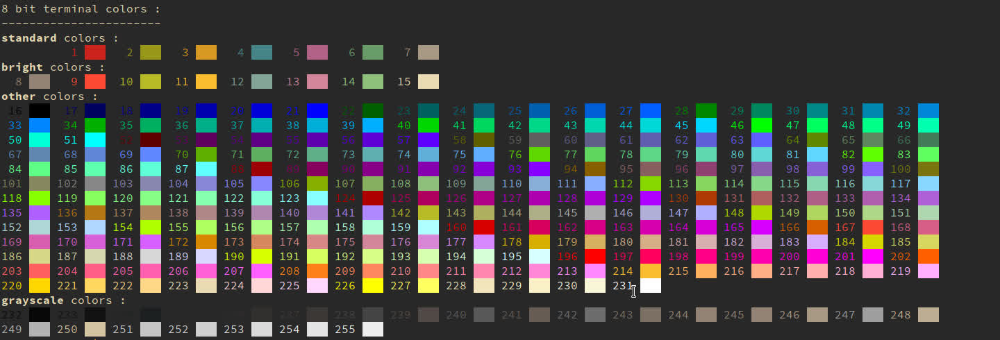

#termcolors
Test whether your terminal supports 8 bit colors or not.

##Screenshot


##Run
Simply put the file termcolors.py wherever you want and run the python
interpreter on it.

##Linux & Co.
Set the right permissions to execute the file
```bash
chmod +x termcolors.py
```
Run the script as a normal executable
```bash
./termcolors.py
```
